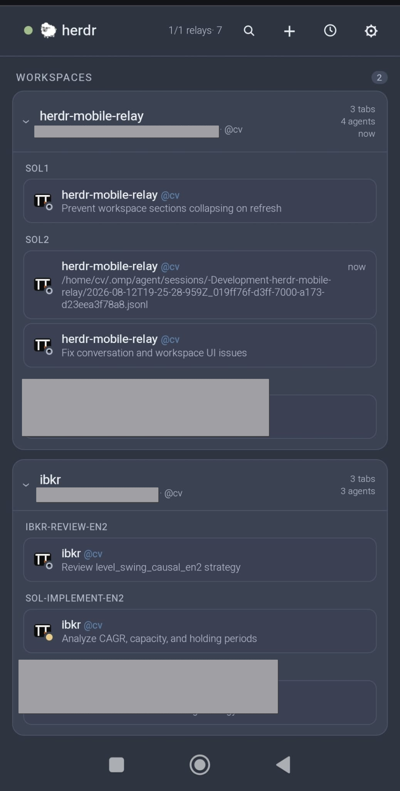
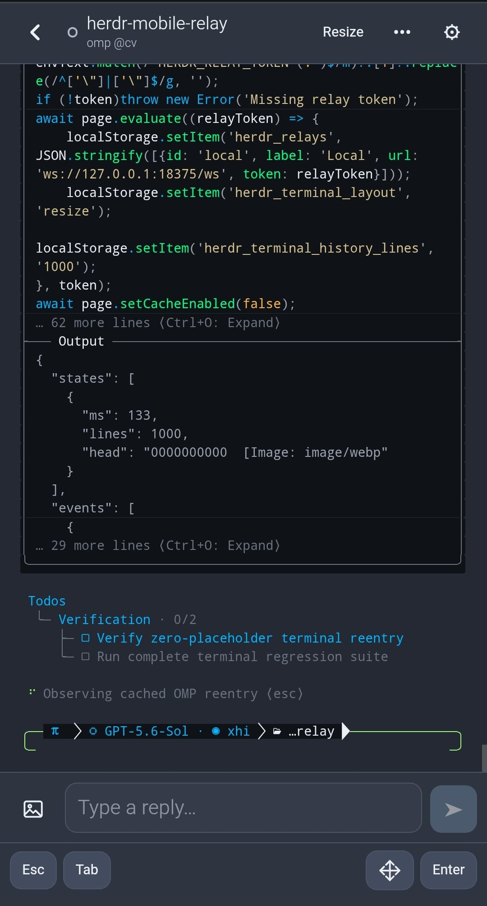

# The Herdr Mobile Relay app

What the phone app does once a relay is connected: the agent list, read-only
workspace inspection, and the mobile terminal. Read this if you have finished
setup and want to know what every screen and control is for.

## What it does

- Monitor and control agents across several computers, with new, closed, and
  renamed agents, workspaces, and tabs reflected within seconds through a
  live Herdr event stream.
- Start, rename, clear, and stop agents from relay-provided launch profiles.
- Send prompts, terminal keys, slash commands, screenshots, and photos; drafts
  survive locally for 48 hours. Search loaded terminal output and open explicit
  HTTP(S) links.
- Answer verified approvals from Codex, Claude Code, Qoder, Oh My Pi, and Pi,
  plus structured questions from those agents and OpenCode.
- Inspect the current agent's workspace files, images, Git status, and unified
  diffs without exposing a write action.
- Read searchable native conversations for Claude Code, Codex, Qoder, Pi, and
  Oh My Pi in focused conversation or full-history form; review a rolling
  24-hour activity summary and receive blocked or completion notifications.
- Optionally require device verification before the app connects at open, and
  again before the interface unlocks on resume. A resume keeps the existing
  encrypted session, so verifying is instant rather than a fresh connection;
  the unlock screen covers the page and the terminal stops streaming until it
  succeeds.
- Detect Codex, Claude Code, OpenCode, Qoder CLI, Pi, Oh My Pi, and Kimi.

| Agents | Native Resize |
| --- | --- |
|  |  |

| Plan Questions | Notifications |
| --- | --- |
|  |  |

| Git Inspection | Native Conversations |
| --- | --- |
|  |  |

## Workspace navigation and inspection

The home screen keeps agents that need input visible at the top. By default,
each workspace below them appears once — mixed — with a dot for its most
notable session: done, then working, then idle. The **Home Workspaces**
setting can separate them into Done, Working, and Idle sections instead; both
layouts retain the workspace and tab hierarchy. On a phone, tap the
magnifying-glass button to search projects, workspaces, paths, tabs, sessions,
agents, hosts, and relays.
At 900 CSS pixels and wider, an agent rail keeps those workspace groups beside
the open terminal.

When the relay advertises tab ordering, press and hold an agent card until its
tab lifts, then drag to reorder the tab in Herdr; a plain tap still opens the
agent, and Alt+arrow keys on a focused card provide the same control. The
change is applied to the desktop immediately.

Opened workspace cards remain expanded after visiting an agent and returning to
the home screen.

The workspace cards come from Herdr's complete workspace inventory rather than
being inferred from active agents. A workspace therefore remains visible when
it contains only a shell or no running agent; the phone does not expose that
shell as a generic terminal.

Open **Workspaces** from the folder button in the header to:

- open **Create Workspace**, choose a directory and label in its dialog, then
  confirm a non-focusing workspace with the native initial tab;
- press and hold a workspace card until it lifts, then drag it into place;
  Alt+arrow keys on its reorder handle provide the same accessible control;
- rename or close a workspace, or start an agent as a second tab in a selected
  workspace;
- open **Worktrees** in a dialog, create a branch-backed worktree, or open an
  existing checkout as a non-focusing Herdr workspace; Git worktrees are flat,
  so the dialog is offered on repository workspaces only, never inside a
  linked worktree;
- close a linked-worktree workspace without deleting its checkout, or remove
  the checkout while retaining its Git branch.

Linked worktrees are nested below their repository workspace on both the home
screen and the Workspaces page, drawn as a tree with connector rails that
match Herdr's parent/child presentation. Rows repeat neither the repository
name nor a checkout path that merely restates the worktree's label; a path
appears only when it differs. Dragging a repository moves that complete group
atomically when Herdr exposes `workspace.move_block`; older compatible Herdr
versions can still move a standalone workspace and ask for an update before
moving a linked group.

Normal worktree removal refuses a dirty checkout. **Force Remove** is offered
only after that refusal and requires a second confirmation because it discards
uncommitted checkout changes. Creating a worktree uses Herdr's configured
worktree directory; the phone cannot provide an arbitrary checkout path.

**Inspect Workspace** is read-only and is available only when the connected
relay advertises workspace inspection and the agent reports a working
directory. The relay confines reads to that directory, skips symlinks and
common generated directories, and returns at most 4,000 tree entries. Text
previews are limited to 1 MiB and image previews to 5 MiB.

Git inspection disables hooks, pagers, text conversion, external diffs, lazy
fetches, and user/system Git configuration. Status is limited to 2,000 changed
files, individual unified diffs to 1 MiB, and Git commands to eight seconds.
On narrow screens, swipe the file or changed-file sidebar left to collapse it;
the adjacent sidebar button restores it. Pinch the diff or use its zoom
controls to resize it without changing the rest of the app.

## Mobile terminal

The mobile terminal always uses **Resize Session**. While a terminal is open
and the app is visible, the relay leases the live PTY at the measured phone
width. Closing the terminal restores the previous width about ten seconds
later, so stepping back into the same agent resumes instantly instead of
resizing the pane twice. A hidden page keeps renewing its lease for five
minutes — desktop Safari reports an occluded window as hidden, so brief
switches to another app must not resize the shared pane — after which the
desktop size returns within about two minutes. A sleeping phone freezes
sooner than that, a disconnecting phone and relay shutdown restore the size
immediately, and returning to the terminal takes the phone size again.

**Lease Terminal Height** (Settings → Terminal, off by default) additionally
leases the phone's measured height, so full-screen agents redraw to fit the
phone instead of serving a mostly empty desktop-sized grid. The shared pane
physically shrinks to phone size on the computer, and each height change can
strand a stale copy of an inline agent's status bar (omp, Claude Code) in the
scrollback: the terminal reflows its primary buffer before the agent can
repaint, and scrollback cannot be erased afterwards. Leave it off unless you
mostly drive full-screen TUIs from the phone. While the height is leased, the
on-screen keyboard never shrinks it — the lease keeps the resting height and
re-measures when the keyboard closes.

Terminal History keeps 100, 500, or 1,000 lines in the terminal view. 1,000 is
the default, the largest option, and the ceiling on the gateway-relayed path.
The "older history" notice reports when rows beyond the served window exist.
Use **Copy** for the latest response or **Conversation History** for clean,
searchable earlier turns.

For supported agents, the terminal header opens **Conversation History** after
the agent reports a session. It opens on the newest turn and stays there as
turns arrive; scrolling up to read holds your position until you return to the
end. **Conversation** keeps each user prompt and the latest agent answer from
that exchange. **Full history** shows every recorded message with collapsible
tool activity. Both use an escaped Markdown subset, search filters the
currently displayed view, and each message can copy its original Markdown.
The composer below the history sends ordinary multiline prompts and accepts
one or more images from the file picker or clipboard. Images are uploaded to
the computer and added to the prompt by path; the history does not render them
inline. Draft persistence, slash-command suggestions, hidden-value entry,
approvals, structured questions, and terminal menus remain in the terminal
view. The composer locks when one of those interactions needs attention, and
the **Terminal** header button switches to the same agent without adding
repeated view toggles to browser history.

Hidden reasoning, injected system records, and sidechain turns remain excluded.
Reads are confined to known session directories and the newest 16 MiB of very
large logs. When that bound omits older turns, they remain in the harness log
on the computer.

Terminal Refresh controls how often the relay checks a visible pane: 100 ms,
250 ms, 500 ms, or 1 second; 250 ms is the default.

**Find** searches the rows loaded into the current terminal view, highlights
visible matches, and moves between the first 1,000 of them.

Explicit HTTP(S) URLs in terminal output become external links with opener and
referrer isolation. When the last terminal lines name supported key hints such
as arrows, Enter, Esc, Tab, Y/N, or a modifier chord, the app offers matching
one-tap actions through the same ordered key path. Detected actions can be
dismissed and never replace verified approval or structured-question controls.

The terminal controls send **Esc**, **Tab** (`⇥`), **Enter**, arrow keys, and
**F1**–**F12** behind the **F keys** row. **Shift** (`⇧`), **Ctrl** (`^`), and
**Alt** can be combined, remain armed for repeated input, and apply to typed
characters or any available terminal key — arm `^` and type `c` to interrupt.
A live status confirms the exact chord. Toggle the modifiers off or move focus
to the composer to disarm them.

When the pane's last line is a prompt that echoes nothing — `[sudo] password
for …`, an SSH passphrase, `gpg`, a PIN — the app names it and offers a masked
field, even though the ordinary composer stays locked on a screen it cannot
classify. The value is typed into the pane as individual keystrokes followed by
Enter. Nothing is sent until you press Send, and the value is never stored on
the phone, never inserted as pasted text, and never recorded in activity or the
audit log. Relays older than this feature say so and leave the prompt to the
computer.

**Copy** captures the agent's latest completed response without ANSI control
sequences. When the relay advertises response copy and the agent is one of
Claude Code, Codex, Kimi, Oh My Pi, Pi, or Qoder, it runs that agent's own copy
command; every other case takes the visible terminal output. The agent command
refuses a busy composer, so it cannot interrupt an in-flight turn.
